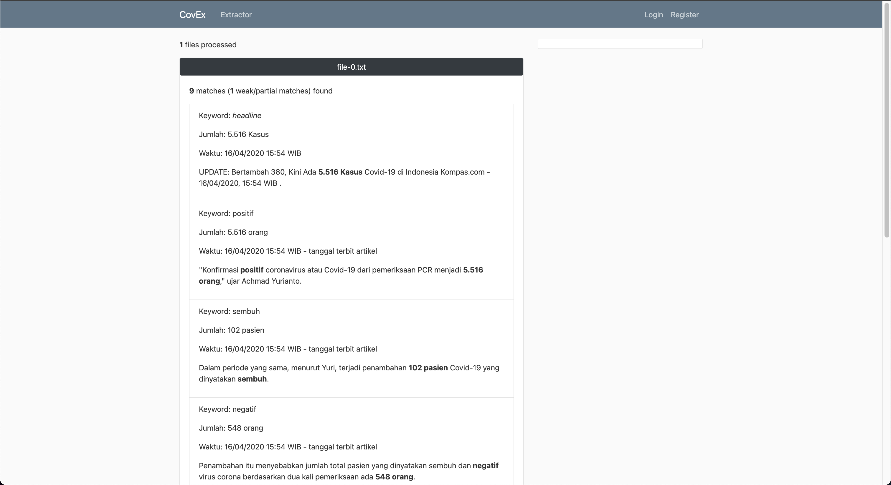

# Covid Information Extractor  [](https://codecov.io/gh/JonathanGun/Covid-keyword-extractor)
A simple web app to extract information from plain text made using Flask Python and Bootstrap. The program is fed with keywords and text files.



## Requirements

1. Python 3.x (tested on 3.6+)
1. Flask
1. WTForms
1. nltk
1. requests (optional - for getting article through link)
1. bs4 (optional)
1. typing (optional - for static analysis)

## Environment Setup

```bash
python3 -m venv venv
source venv/bin/activate
pip install -r requirements.txt
```

## Running

```bash
python3 main.py
```

## Built With

- Flask
- WTForms

## Contributing

Feel free to fork and made a pull request, make sure to test it first using pytest

### Testing Program
```
cd src
pip install pytest
pytest
```

## Authors

- Jonathan Yudi Gunawan - Initial work

## Acknowlegdement

This program is made to fulfill IF2211 Strategi Algoritma assessment.

## Live Demo

You can try the program [here](http://covex.herokuapp.com/)
